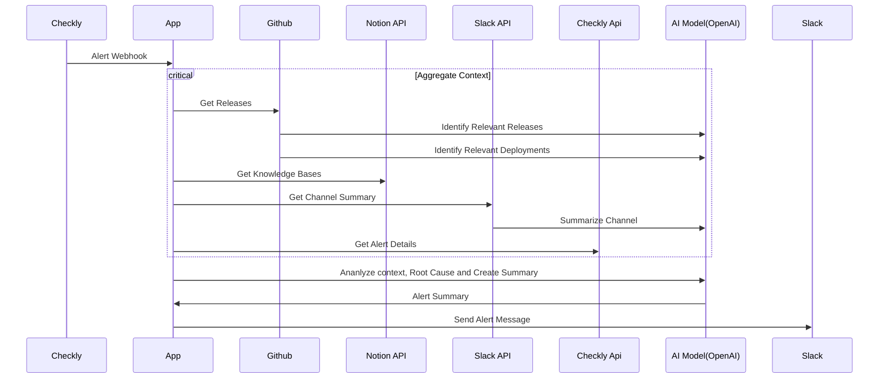

# SREBot

A Site Reliability Engineering (SRE) bot that integrates with Slack, GitHub, and Checkly to help manage incidents and improve Mean Time To Resolution (MTTR).

## Features

- Real-time incident management through Slack
- Integration with Checkly for monitoring alerts
- GitHub integration for tracking releases and changes
- AI-powered assistance using OpenAI
- Automatic context aggregation for incidents

## Prerequisites

- Node.js v22.11.0
- Docker and Docker Compose
- PostgreSQL (via Docker or local installation)
- Accounts and API keys for:
  - OpenAI
  - Slack
  - GitHub
  - Checkly

## Setup

### 1. Environment Variables

Duplicate the `env.example` file in the root directory and add your keys as per requirements

### 2. Database Setup

The project uses PostgreSQL as its database. To set it up using Docker:

1. Start the PostgreSQL container:

   ```bash
   docker compose up -d
   ```

1. Run database migrations:

   ```bash
   npm run db:migrate
   ```

1. (Optional) To explore the database using Prisma Studio:

   ```bash
   npm run db:studio
   ```

To reset the database if needed:

```bash
docker compose down -v  # Remove containers and volumes
docker compose up -d    # Start fresh
npm run db:migrate     # Run migrations again
```

### 3. Installation

1. Install dependencies

```bash
npm install
```

1. Initialize the OpenAI assistant

   - First, get your [OpenAI API key](https://platform.openai.com/api-keys)
   - Add the API key to your .env file
   - Create the assistant by running:

   ```bash
   npx ts-node scripts/init-assistant.ts
   ```

Go to the [OpenAI Portal](https://platform.openai.com/assistants) to find your assistant ID

## Running the Application

There are several ways to run the application depending on your needs:

### Development Mode

```bash
npm run dev
```

### Slack Bot Only

```bash
npm run bot:start
```

### Production Mode

```bash
npm run build
npm start
```

### Running Tests

```bash
npm test
```

## Project Structure

- `/src/aggregator`: Context aggregation logic for incidents
- `/src/ai`: AI assistant and tool implementations
- `/src/checkly`: Checkly API integration
- `/src/github`: GitHub API integration
- `/src/routes`: API routes for webhooks
- `/src/slackbot`: Slack bot implementation
- `/src/sre-assistant`: Main SRE assistant logic
- `/prisma`: Database schema and migrations

## Available Commands

- `npm run dev`: Start development server
- `npm run bot:start`: Start Slack bot only
- `npm run build`: Build the application
- `npm start`: Start the built application
- `npm test`: Run tests
- `npm run db:migrate`: Run database migrations
- `npm run db:studio`: Open Prisma Studio
- `npm run db:deploy`: Deploy database migrations
- `npm run db:generate`: Generate Prisma client

## External Service Setup

### Slack Setup

1. Create a new Slack app in your [workspace](https://api.slack.com/apps)
1. Configure Bot Token Scopes:
   - chat:write
   - app_mentions:read
   - commands
1. Install the app to your workspace
1. Copy the signing secret, bot token, and app token to your .env file

### GitHub Setup

1. Create a Personal Access Token with repo permissions
1. Configure webhook in your organization/repository:
   - Payload URL: your-server/github-webhook
   - Content type: application/json
   - Secret: Same as GH_WEBHOOK_SECRET in .env
   - Events: Release events

### Checkly Setup

1. Get your [API key and Account ID from Checkly](https://app.checklyhq.com/settings/user/api-keys)
1. Configure webhook in Checkly:
   - URL: your-server/checkly-webhook
   - Select relevant alert types

### Architecture



## License

ISC License - see the LICENSE file for details
