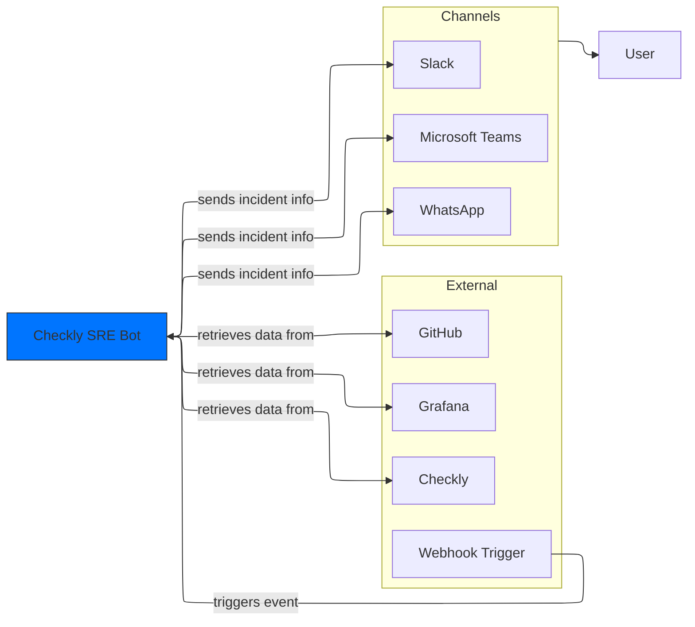
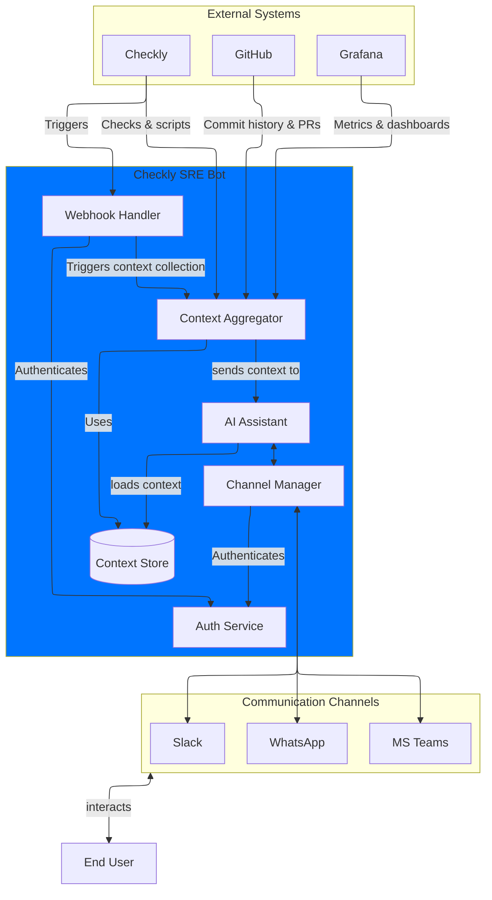
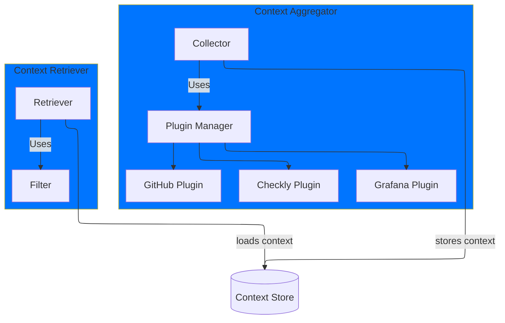

# **Checkly SRE Bot: Intelligent Incident Response System**

### **Project Vision**

An intelligent, real-time incident management system that transforms raw alerts into actionable insights by automatically aggregating and analyzing contextual data from relevant sources, reducing human effort and accelerating response.

### **Core Value Proposition**

- **Reduce MTTR** through automated, proactive context gathering and analysis
- **Eliminate initial context gathering** during incidents with real-time data integration
- **Provide intelligent, AI-powered insights** that guide response actions effectively

### **Key Features**

1. **Proactive Context Collection**
   - Automatically gathers pertinent incident data as soon as an alert is triggered.
   - Integrates data from multiple systems (e.g., GitHub, logs, traces) in real time.
2. **Intelligent Analysis**
   - Employs AI-driven analysis to assess context, prioritize critical data, and provide probable root cause insights.
   - Integrates a follow-up assistant to handle user queries, refining and extending initial insights.
3. **Seamless Integration**
   - Modular plugin-based architecture allowing easy extensibility with additional tools.
   - Native integrations with Checkly and options for expanding to other DevOps tools like Grafana or Datadog.
   - Multi-channel support, with initial Slack integration for real-time incident collaboration.

### **System Structure**

1. **Input Layer**
   - **Alert Ingestion**: Triggers from Checkly and other sources to initiate incident response.
   - **Authentication**: Ensures secure data flow and plugin access.
   - **Initial Processing**: Standardizes incoming data for streamlined handling by downstream layers.
2. **Intelligence Layer**
   - **Context Aggregation**: Aggregates and organizes data from plugins via a key-value-based Context Store.
   - **AI Analysis**: Utilizes LLMs to analyze, filter, and summarize context into actionable insights.
   - **AI Chatbot**: Manages follow-up questions and user interactions, refining the context and retrieving relevant data on demand.
3. **Communication Layer**
   - **Channel Adapter**: Integrates with communication tools (initially Slack) for incident updates and user responses.
   - **User Interactions**: Supports threading, allowing users to query for additional insights directly in incident threads.

### **Target Outcomes**

1. **Operational**
   - Faster incident response and MTTR reduction
   - More accurate root cause identification
   - Lower manual investigation load on responders
2. **Strategic**
   - Improved system reliability through faster and more accurate incident resolution
   - Optimized resource allocation by reducing on-call demands
   - Enhanced team collaboration by centralizing incident communications
3. **Technical**
   - Scalable architecture that supports horizontal expansion
   - Easily extensible platform for additional plugins and data sources
   - Maintainable and modular codebase enabling continuous improvement and community contributions

### **Success Metrics**

- **MTTR Reduction**: Percentage decrease in time to incident resolution.
- **Insight Accuracy**: Rate of correct root cause identification by the AI.
- **User Engagement**: Frequency of follow-up interactions with AI insights and recommendations.
- **System Adoption Rate**: Team usage and reliance on the bot during incident management.
- **Integration Effectiveness**: Efficiency and relevance of data from integrated tools.

---

## System Context

## Checkly SRE Bot

## Context Aggregator & Retriever

## AI Assistant

```mermaid
---
config:
  layout: elk
  elk:
    mergeEdges: true
    nodePlacementStrategy: LINEAR_SEGMENTS
---
graph TB

    subgraph AIAssistant[AI Assistant]
        LLM[LLM Interface]
        ThreadManager[Thread Manager]
        PromptManager[Prompt Manager]
        Assistant[Assistant]

        subgraph Tools[Tools]
            AggregatorTool[Aggregator Tool]
            RetrieverTool[Retriever Tool]
            ChecklyTool[Checkly Tool]
        end

        subgraph Prompts[Prompts]
            BasePrompt[System Prompt]
            AnalysisPrompt[Analysis Prompt]
            SummaryPrompt[Summary Prompt]
        end

        subgraph Threads[Threads]
            MessageHistory[Message History]
            MemoryStore[Memory Store]
        end
    end

    %% Relationships
    LLM -- powers --> Assistant
    Assistant -- Uses --> ThreadManager
    Assistant -- Uses --> PromptManager
    Assistant -- Uses --> Tools
    PromptManager -- renders --> Prompts
    ThreadManager -- stores --> Threads


    style AIAssistant fill:#0075FF
    style Tools fill:#051734
    style Prompts fill:#051734
    style Threads fill:#051734

```

